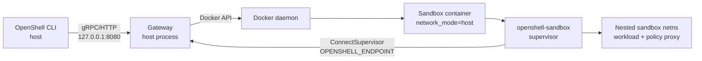

# Docker Driver

The Docker compute driver manages sandbox containers through the local Docker
daemon using the `bollard` client. It targets local developer environments
where running a full Kubernetes cluster is unnecessary but Docker is already
available.

The gateway remains a host process. Each sandbox container bind-mounts a Linux
`openshell-sandbox` supervisor binary and uses Docker host networking so the
supervisor can connect to a gateway that is listening on host loopback without
requiring an additional bridge-reachable listener on Linux.

## Source Map

| Path | Purpose |
|---|---|
| `crates/openshell-driver-docker/src/lib.rs` | Docker compute driver implementation |
| `crates/openshell-driver-docker/src/tests.rs` | Unit tests for container spec, env, TLS paths, GPU, resource limits, and cache helpers |
| `crates/openshell-server/src/cli.rs` | Gateway CLI flags for Docker driver configuration |
| `crates/openshell-server/src/lib.rs` | In-process Docker compute runtime wiring |

## Runtime Model



The Docker container itself uses `network_mode = "host"`. This is intentional
for now: it makes a gateway bound to `127.0.0.1` reachable from the supervisor
as `127.0.0.1`, matching the host process' endpoint without a bridge listener,
NAT rule, or userland proxy.

The container also gets a Docker-managed `/etc/hosts` entry for
`host.openshell.internal` that resolves to `127.0.0.1`. This gives callers a
stable OpenShell-owned hostname for host services without requiring changes to
the host machine's hosts file.

The supervisor still creates a nested network namespace for the actual workload
and routes workload traffic through its policy proxy. Agent network requests are
enforced by the supervisor in that nested namespace.

## Container Spec

`build_container_create_body()` constructs the Docker container:

| Field | Value | Reason |
|---|---|---|
| `image` | Sandbox template image | User-selected runtime image |
| `user` | `"0"` | Supervisor needs root inside the container for namespace and mount setup |
| `entrypoint` | `/opt/openshell/bin/openshell-sandbox` | Bind-mounted supervisor binary |
| `cmd` | Empty vector | Prevents image CMD args from being appended to the supervisor entrypoint |
| `network_mode` | `"host"` | Lets supervisor connect to host loopback gateway endpoints |
| `extra_hosts` | `host.openshell.internal:127.0.0.1` | Stable container-local alias for host loopback services |
| `cap_add` | `SYS_ADMIN`, `NET_ADMIN`, `SYS_PTRACE`, `SYSLOG` | Required for supervisor isolation setup and process inspection |
| `security_opt` | `apparmor=unconfined` | Docker's default AppArmor profile blocks mount operations required by network namespace setup |
| `restart_policy` | `unless-stopped` | Resume managed sandboxes after Docker or gateway restarts |
| `device_requests` | CDI all-GPU request when `spec.gpu` is true | Enables Docker CDI GPU sandboxes when daemon support is detected |

## Gateway Callback

The Docker driver injects `OPENSHELL_ENDPOINT` into each sandbox container from
`Config::grpc_endpoint` without rewriting it. This is the key difference from a
bridge-network design.

Examples:

```shell
OPENSHELL_GRPC_ENDPOINT=http://127.0.0.1:8080
```

and:

```shell
OPENSHELL_GRPC_ENDPOINT=https://127.0.0.1:8080
```

are passed into the supervisor as-is. Because the container shares the host
network namespace, `127.0.0.1` resolves to the host loopback interface and the
gateway is reachable when it binds loopback.

The endpoint can also use the stable alias:

```shell
OPENSHELL_GRPC_ENDPOINT=http://host.openshell.internal:8080
```

In host network mode this name resolves to `127.0.0.1` inside the container.

For TLS endpoints, the gateway certificate must include the exact endpoint host
as a subject alternative name. For `https://127.0.0.1:8080`, the certificate
needs an IP SAN for `127.0.0.1`. For `https://localhost:8080`, it needs a DNS
SAN for `localhost`. For `https://host.openshell.internal:8080`, it needs a DNS
SAN for `host.openshell.internal`. Docker sandboxes also require client TLS
material:

| Env / flag | Purpose |
|---|---|
| `OPENSHELL_DOCKER_TLS_CA` / `--docker-tls-ca` | CA certificate mounted at `/etc/openshell/tls/client/ca.crt` |
| `OPENSHELL_DOCKER_TLS_CERT` / `--docker-tls-cert` | Client certificate mounted at `/etc/openshell/tls/client/tls.crt` |
| `OPENSHELL_DOCKER_TLS_KEY` / `--docker-tls-key` | Client private key mounted at `/etc/openshell/tls/client/tls.key` |

When `OPENSHELL_GRPC_ENDPOINT` uses `http://`, these TLS mounts are not
required and providing them is rejected. When it uses `https://`, all three are
required.

## Environment

`build_environment()` merges template environment, spec environment, and
driver-controlled keys. Driver-controlled keys win:

| Variable | Value |
|---|---|
| `OPENSHELL_ENDPOINT` | Exact configured gateway endpoint |
| `OPENSHELL_SANDBOX_ID` | Sandbox id |
| `OPENSHELL_SANDBOX` | Sandbox name |
| `OPENSHELL_SSH_SOCKET_PATH` | Unix socket path used by the supervisor's embedded SSH daemon |
| `OPENSHELL_SANDBOX_COMMAND` | `sleep infinity` |
| `OPENSHELL_TLS_CA` | Mounted CA path when HTTPS is enabled |
| `OPENSHELL_TLS_CERT` | Mounted client cert path when HTTPS is enabled |
| `OPENSHELL_TLS_KEY` | Mounted client key path when HTTPS is enabled |

The Docker driver does not inject `OPENSHELL_SSH_HANDSHAKE_SECRET`; the
supervisor-to-gateway path relies on mTLS for the Docker callback.
