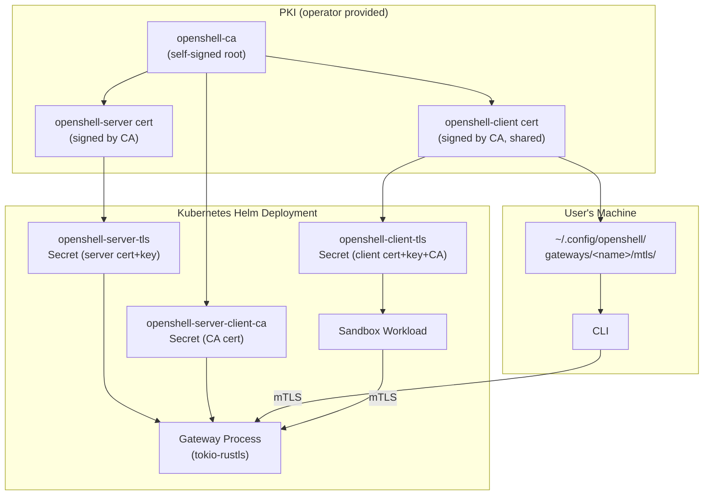
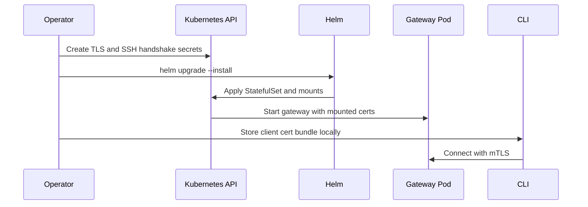
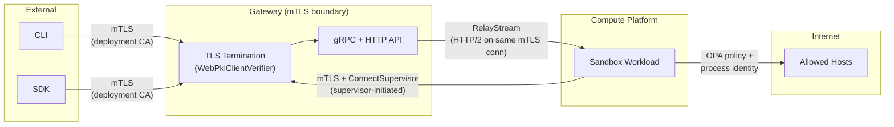

# Gateway Security

## Overview

By default, communication with the OpenShell gateway is secured by mutual TLS (mTLS). The CLI, SDK, and sandbox workloads present certificates signed by the deployment CA before they reach any application handler. In Helm deployments, operators provide the certificate bundle as Kubernetes secrets and place the CLI client bundle in the local gateway credential directory. Non-Kubernetes deployments provide equivalent certificate files to the gateway and sandbox runtime.

The gateway also supports Cloudflare-fronted deployments where the edge, not the gateway, is the first authentication boundary. In that mode the gateway either keeps TLS enabled but allows no-certificate client handshakes (`allow_unauthenticated=true`) and relies on application-layer Cloudflare JWTs, or disables gateway TLS entirely and serves plaintext behind a trusted reverse proxy or tunnel.

This document covers the certificate hierarchy, how gateway transport security modes are enforced, how sandboxes and the CLI consume their certificates, and the broader security model of the gateway.

## Architecture Diagram



## Certificate Hierarchy

The default PKI shape is a single-tier CA hierarchy. Operators can generate this bundle with their internal PKI tooling, cert-manager, or a local development CA.

```text
openshell-ca  (Self-signed Root CA, O=openshell, CN=openshell-ca)
├── openshell-server  (Leaf cert, CN=openshell-server)
│   SANs: openshell, openshell.openshell.svc,
│          openshell.openshell.svc.cluster.local,
│          localhost, host.docker.internal, 127.0.0.1
│          + extra SANs for remote deployments
│
└── openshell-client  (Leaf cert, CN=openshell-client)
    Shared by the CLI and all sandbox workloads.
```

Key design decisions:

- **Single client certificate**: One client cert is shared by the CLI and every sandbox workload. This simplifies secret management. Individual sandbox identity is not expressed at the TLS layer; post-authentication identification uses the `x-sandbox-id` gRPC header.
- **Certificate lifetime**: Certificate validity is owned by the operator's PKI policy.
- **CA key not stored in OpenShell**: The chart consumes certificates and CA bundles, but it does not need the CA private key.

## Kubernetes Secret Distribution

In Helm deployments, the PKI bundle is distributed as three Kubernetes secrets in the `openshell` namespace:

| Secret Name | Type | Contents | Consumed By |
|---|---|---|---|
| `openshell-server-tls` | `kubernetes.io/tls` | `tls.crt` (server cert), `tls.key` (server key) | Gateway StatefulSet |
| `openshell-server-client-ca` | `Opaque` | `ca.crt` (CA cert) | Gateway StatefulSet (client verification) |
| `openshell-client-tls` | `Opaque` | `tls.crt` (client cert), `tls.key` (client key), `ca.crt` (CA cert) | Sandbox workloads, CLI (via local filesystem) |

Secret names are chart values under `server.tls.*` in `deploy/helm/openshell/values.yaml`.

### Gateway Mounts

The Helm StatefulSet (`deploy/helm/openshell/templates/statefulset.yaml`) mounts:

| Volume | Mount Path | Source Secret |
|---|---|---|
| `tls-cert` | `/etc/openshell-tls/server/` (read-only) | `openshell-server-tls` |
| `tls-client-ca` | `/etc/openshell-tls/client-ca/` (read-only) | `openshell-server-client-ca` |

Environment variables point the gateway binary to these paths:

```text
OPENSHELL_TLS_CERT=/etc/openshell-tls/server/tls.crt
OPENSHELL_TLS_KEY=/etc/openshell-tls/server/tls.key
OPENSHELL_TLS_CLIENT_CA=/etc/openshell-tls/client-ca/ca.crt
```

### Sandbox Workload TLS Material

When the Kubernetes driver creates a sandbox pod, it injects:

- A volume backed by the `openshell-client-tls` secret.
- A read-only mount at `/etc/openshell-tls/client/` on the agent container.
- Environment variables for the sandbox gRPC client:

```text
OPENSHELL_TLS_CA=/etc/openshell-tls/client/ca.crt
OPENSHELL_TLS_CERT=/etc/openshell-tls/client/tls.crt
OPENSHELL_TLS_KEY=/etc/openshell-tls/client/tls.key
OPENSHELL_ENDPOINT=https://openshell.openshell.svc.cluster.local:8080
```

### CLI Local Storage

The CLI's copy of the client certificate bundle is written to:

```text
$XDG_CONFIG_HOME/openshell/gateways/<gateway-name>/mtls/
├── ca.crt
├── tls.crt
└── tls.key
```

Files are written atomically using a temp-dir -> validate -> rename strategy with backup and rollback on failure. See `crates/openshell-bootstrap/src/mtls.rs:10`.

## PKI Provisioning Sequence

PKI provisioning is operator-driven:

1. Generate or obtain a server certificate, server key, client certificate, client key, and CA certificate.
2. Provide the server certificate and client CA to the gateway process.
3. Provide the client certificate bundle to sandbox workloads through the selected compute driver.
4. Store the same client bundle under `~/.config/openshell/gateways/<name>/mtls/` so the CLI can authenticate to the gateway.

For Helm deployments, steps 2 and 3 use the `openshell-server-tls`, `openshell-server-client-ca`, and `openshell-client-tls` Kubernetes secrets before installing or upgrading the chart.



## Gateway TLS Enforcement

The gateway supports three transport modes:

1. **mTLS (default)** -- TLS is enabled and client certificates are required.
2. **Dual-auth TLS** -- TLS is enabled, but the handshake also accepts clients without certificates (`allow_unauthenticated=true`). This is used for Cloudflare Tunnel deployments where the edge authenticates the user and forwards a Cloudflare JWT to the gateway.
3. **Plaintext behind edge** -- TLS is disabled at the gateway and the service listens on HTTP behind a trusted reverse proxy or tunnel.

### Server Configuration

`TlsAcceptor::from_files()` (`crates/openshell-server/src/tls.rs:27`) constructs the `rustls::ServerConfig`:

1. **Server identity**: loads the server certificate and private key from PEM files (supports PKCS#1, PKCS#8, and SEC1 key formats).
2. **Client verification**: builds a `WebPkiClientVerifier` from the CA certificate. In the default mode it requires a valid client certificate; in dual-auth mode it also accepts no-certificate clients and defers authentication to the HTTP/gRPC layer.
3. **ALPN**: advertises `h2` and `http/1.1` for protocol negotiation.

### Connection Flow

```text
TCP accept
  → TLS handshake (mandatory client cert in mTLS mode, optional in dual-auth mode)
  → hyper auto-negotiates HTTP/1.1 or HTTP/2 via ALPN
  → MultiplexedService routes by content-type:
      ├── application/grpc → GrpcRouter
      └── other → Axum HTTP Router
```

All traffic shares a single port. When TLS is enabled, the TLS handshake occurs before any HTTP parsing. In plaintext mode, the gateway expects an upstream reverse proxy or tunnel to be the outer security boundary.

### Cloudflare-Specific HTTP Endpoints

Cloudflare-fronted gateways add two HTTP endpoints on the same multiplexed port:

- `/auth/connect` -- browser login relay that reads the `CF_Authorization` cookie server-side and POSTs the token back to the CLI's localhost callback server.
- `/_ws_tunnel` -- WebSocket upgrade endpoint used to carry gRPC and SSH bytes through Cloudflare Access.

The WebSocket tunnel bridges directly into the gateway's `MultiplexedService` over an in-memory duplex stream. It does not re-enter the public listener, so it behaves the same whether the public listener is plaintext or TLS-backed.

### What Gets Rejected

The e2e test suite (`e2e/python/test_security_tls.py`) validates four scenarios:

| Scenario | Result |
|---|---|
| Client presents correct mTLS cert | `HEALTHY` response |
| Client trusts CA but presents no client cert | `UNAVAILABLE` -- handshake terminated |
| Client presents cert signed by a different CA | `UNAVAILABLE` -- handshake terminated |
| Client connects with plaintext (no TLS) | `UNAVAILABLE` -- transport failure |

## Sandbox-to-Gateway mTLS

Sandbox workloads connect back to the gateway at startup to fetch their policy and provider credentials. The gRPC client (`crates/openshell-sandbox/src/grpc_client.rs:18`) reads three environment variables to configure mTLS:

| Env Var | Value |
|---|---|
| `OPENSHELL_TLS_CA` | `/etc/openshell-tls/client/ca.crt` |
| `OPENSHELL_TLS_CERT` | `/etc/openshell-tls/client/tls.crt` |
| `OPENSHELL_TLS_KEY` | `/etc/openshell-tls/client/tls.key` |

These are used to build a `tonic::transport::ClientTlsConfig` with:

- `ca_certificate()` -- verifies the server's certificate against the deployment CA.
- `identity()` -- presents the shared client certificate for mTLS.

The sandbox calls two RPCs over this authenticated channel:

- `GetSandboxSettings` -- fetches the YAML policy that governs the sandbox's behavior.
- `GetSandboxProviderEnvironment` -- fetches provider credentials as environment variables.

## SSH Tunnel Authentication

SSH connections into sandboxes pass through the gateway's HTTP CONNECT tunnel at `/connect/ssh`. This adds a second authentication layer on top of mTLS.

### Request Headers

| Header | Purpose |
|---|---|
| `x-sandbox-id` | Identifies the target sandbox |
| `x-sandbox-token` | Session token (created via `CreateSshSession` RPC) |

The gateway validates the token against the stored `SshSession` record and checks:

1. The token has not been revoked.
2. The `sandbox_id` matches the request header.
3. The token has not expired (`expires_at_ms` check; 0 means no expiry for backward compatibility).

### Session Lifecycle

SSH session tokens have a configurable TTL (`ssh_session_ttl_secs`, default 24 hours). The `expires_at_ms` field is set at creation time and checked on every tunnel request. Setting the TTL to 0 disables expiry.

Sessions are cleaned up automatically:

- **On sandbox deletion**: all SSH sessions for the deleted sandbox are removed from the store.
- **Background reaper**: a periodic task (hourly) deletes expired and revoked session records to prevent unbounded database growth.

### Connection Limits

The gateway enforces two concurrent connection limits to bound the impact of credential misuse:

| Limit | Value | Purpose |
|---|---|---|
| Per-token | 10 concurrent tunnels | Limits damage from a single leaked token |
| Per-sandbox | 20 concurrent tunnels | Prevents bypass via creating many tokens for one sandbox |

These limits are tracked in-memory and decremented when tunnels close. Exceeding either limit returns HTTP 429 (Too Many Requests).

### Supervisor-Initiated Relay Model

The gateway never dials the sandbox. Instead, the sandbox supervisor opens an outbound `ConnectSupervisor` bidirectional gRPC stream to the gateway on startup and keeps it alive for the sandbox lifetime. SSH traffic for `/connect/ssh` (and exec traffic for `ExecSandbox`) rides this same TCP+TLS+HTTP/2 connection as separate multiplexed HTTP/2 streams. The gateway-side registry and `RelayStream` handler live in `crates/openshell-server/src/supervisor_session.rs`; the supervisor-side bridge lives in `crates/openshell-sandbox/src/supervisor_session.rs`.

Per-connection flow:

1. CLI presents `x-sandbox-id` + `x-sandbox-token` at `/connect/ssh` and passes gateway token validation.
2. Gateway calls `SupervisorSessionRegistry::open_relay(sandbox_id, ...)`, which allocates a `channel_id` (UUID) and sends a `RelayOpen` message to the supervisor over the already-established `ConnectSupervisor` stream. If no session is registered yet, it polls with exponential backoff up to a bounded timeout (30 s for `/connect/ssh`, 15 s for `ExecSandbox`).
3. The supervisor opens a new `RelayStream` RPC on the same `Channel` — a new HTTP/2 stream, no new TCP connection and no new TLS handshake. The first `RelayFrame` is a `RelayInit { channel_id }` that claims the pending slot on the gateway.
4. `claim_relay` pairs the gateway-side waiter with the supervisor-side RPC via a `tokio::io::duplex(64 KiB)` pair. Subsequent `RelayFrame::data` frames carry raw SSH bytes in both directions. The supervisor is a dumb byte bridge: it has no protocol awareness of the SSH bytes flowing through.
5. Inside the sandbox workload, the supervisor connects the relay to sshd over a Unix domain socket at `/run/openshell/ssh.sock`.

Security properties of this model:

- **One auth boundary.** mTLS on the `ConnectSupervisor` stream is the only identity check between gateway and sandbox. Every relay rides that same authenticated HTTP/2 connection.
- **No inbound network path into the sandbox.** The sandbox exposes no TCP port for gateway ingress; all relays are supervisor-initiated. The workload only needs egress to the gateway.
- **In-workload access control is filesystem permissions on the Unix socket.** sshd listens on `/run/openshell/ssh.sock` with the parent directory at `0700` and the socket itself at `0600`, both owned by the supervisor (root). The sandbox entrypoint runs as an unprivileged user and cannot open either. Any process in the supervisor's filesystem view that can open the socket can reach sshd; this is the same trust model as any local Unix socket with `0600` permissions. See `crates/openshell-sandbox/src/ssh.rs:55-83`.
- **Supersede race is closed.** A supervisor reconnect registers a new `session_id` for the same sandbox id. Cleanup on the old session's task uses `remove_if_current(sandbox_id, session_id)` so a late-finishing old task cannot evict the new registration or serve relays meant for the new instance. See `SupervisorSessionRegistry::remove_if_current` in `crates/openshell-server/src/supervisor_session.rs`.
- **Pending-relay reaper.** A background task sweeps `pending_relays` entries older than 10 s (`RELAY_PENDING_TIMEOUT`). If the supervisor acknowledges `RelayOpen` but never initiates `RelayStream` — crash, deadlock, or adversarial stall — the gateway-side slot does not pin indefinitely.
- **Client-side keepalives.** The CLI's `ssh` invocation sets `ServerAliveInterval=15` / `ServerAliveCountMax=3` (`crates/openshell-cli/src/ssh.rs:150`), so a silently-dropped relay (gateway restart, supervisor restart, or adversarial TCP drop) surfaces to the user within roughly 45 s rather than hanging.

Observability (sandbox side, OCSF): `session_established`, `session_closed`, `session_failed`, `relay_open`, `relay_closed`, `relay_failed`, `relay_close_from_gateway` — all emitted as `NetworkActivity` events. Gateway-side OCSF emission for the same lifecycle is a tracked follow-up.

## Port Configuration

Traffic flows through the configured gateway exposure path to the gateway process. Kubernetes deployments use the Helm-managed service; standalone deployments bind the gateway port directly or place it behind an operator-managed proxy.

| Layer | Port | Configurable Via |
|---|---|---|
| External ingress / port-forward / load balancer / reverse proxy | Operator choice | Platform-specific service or proxy configuration |
| Kubernetes Service | `8080` by default | `deploy/helm/openshell/values.yaml` (`service.port`) |
| NodePort, when enabled | `30051` by default | `deploy/helm/openshell/values.yaml` (`service.nodePort`) |
| Server bind | `8080` | `--port` flag / `OPENSHELL_SERVER_PORT` env var |

The server binds `0.0.0.0:8080` by default. The chart maps the service port to the gateway workload's `grpc` port for Kubernetes deployments.

## Security Model Summary

### Trust Boundaries



### What Is Authenticated

| Boundary | Mechanism |
|---|---|
| External → Gateway | mTLS with deployment CA by default, or trusted reverse-proxy/Cloudflare boundary in edge mode |
| Sandbox → Gateway | mTLS with shared client cert (supervisor-initiated `ConnectSupervisor` stream) |
| Gateway → Sandbox (SSH/exec) | Rides the supervisor's mTLS `ConnectSupervisor` HTTP/2 connection as a `RelayStream`; no separate gateway-to-sandbox network connection |
| Supervisor → workload sshd | Unix-socket filesystem permissions (`/run/openshell/ssh.sock`, 0700 parent / 0600 socket) |
| Sandbox → External (network) | OPA policy + process identity binding via `/proc` |

### What Is Not Authenticated (by Design)

- **Individual sandbox identity at the TLS layer**: all sandboxes share one client certificate (`CN=openshell-client`). Post-TLS identification uses the `x-sandbox-id` gRPC metadata header, which is trusted because it arrives over an mTLS-authenticated channel.
- **Health endpoints in reverse-proxy mode**: when the gateway is deployed behind Cloudflare or another trusted edge, `/health`, `/healthz`, and `/readyz` are protected by that upstream boundary rather than by direct mTLS at the gateway.

### Gateway Security Context

The gateway workload runs with a hardened security context (`deploy/helm/openshell/values.yaml:25`):

```yaml
securityContext:
  runAsNonRoot: true
  runAsUser: 1000
  allowPrivilegeEscalation: false
  capabilities:
    drop:
      - ALL
```

The gateway process has no elevated privileges and drops all Linux capabilities.

## Threat Model

This section defines the primary attacker profiles, what the current design protects, and where residual risk remains.

### Security Goals

- Prevent unauthenticated access to gateway APIs and SSH tunneling.
- Prevent unauthorized sandbox access across tenants/sessions.
- Protect sandbox-to-gateway policy and credential exchange in transit.
- Limit impact from network-level attackers and accidental misconfiguration.

### In Scope Threat Actors

| Threat Actor | Example Capability |
|---|---|
| Network attacker | Can observe/modify traffic between clients and gateway |
| Unauthorized external client | Can reach gateway port but has no valid client cert |
| Compromised sandbox workload | Has code execution inside one sandbox workload |
| Malicious platform peer | Can attempt direct workload-to-workload connections |
| Stolen CLI credentials | Has copied `ca.crt`/`tls.crt`/`tls.key` from a developer machine |

### Primary Defenses

| Threat | Existing Defense | Notes |
|---|---|---|
| MITM or passive interception of gateway traffic | Mandatory mTLS with deployment CA, or trusted reverse-proxy boundary in Cloudflare mode | Default mode is direct mTLS; reverse-proxy mode shifts the outer trust boundary upstream |
| Unauthenticated API/health access | mTLS by default, or Cloudflare/reverse-proxy auth in edge mode | `/health*` are direct-mTLS only in the default deployment mode |
| Forged SSH tunnel connection to sandbox | Session token validation at the gateway; only the supervisor's authenticated mTLS `ConnectSupervisor` stream can carry a `RelayStream` to its sandbox | Forging a relay requires stealing a valid mTLS client identity |
| Direct access to sandbox sshd from platform peers | sshd listens on a Unix socket (`0700` parent / `0600` socket) inside the workload | No network path exists to sshd from platform peers |
| Stale or reconnecting supervisor serves relays for a new instance | `session_id`-scoped `remove_if_current` on the registry | Old session cleanup cannot evict a newer registration |
| Supervisor acknowledges `RelayOpen` but never initiates `RelayStream` | Gateway-side pending-relay reaper (10 s timeout) | Prevents indefinite resource pinning by a buggy or malicious supervisor |
| Silent TCP drop of an in-flight relay | CLI `ServerAliveInterval=15` / `ServerAliveCountMax=3` | Client detects a dead relay within ~45 s instead of hanging |
| Unauthorized outbound internet access from sandbox | OPA policy + process identity checks | Applies to sandbox egress policy layer |

### Residual Risks and Current Tradeoffs

| Risk | Why It Exists |
|---|---|
| No per-sandbox TLS identity | All sandboxes and CLI share one client certificate |
| Broad blast radius on key compromise | Shared client key reuse across multiple components |
| Weak cryptoperiod | Certificates are effectively non-expiring by default |
| Limited fine-grained revocation | CA private key is not persisted; rotation is coarse-grained |
| Local credential theft risk | CLI mTLS key material is stored on developer filesystem |
| SSH token + mTLS = persistent access within trust boundary | SSH tokens expire after 24h (configurable) and are capped at 3 concurrent connections per token / 20 per sandbox, but within the mTLS trust boundary a stolen token remains usable until TTL expires |

### Out of Scope / Not Defended By This Layer

- A fully compromised compute platform, such as a Kubernetes control plane, container host, or VM host.
- A malicious actor with direct access to deployment secrets for the gateway or sandbox runtime.
- Host-level compromise of the developer workstation running the CLI.
- Application-layer authorization bugs after mTLS authentication succeeds.

### Trust Assumptions

- The deployment CA is generated and distributed without interception during provisioning.
- Secret access is restricted to intended workloads and operators.
- Gateway and sandbox container images are trusted and not tampered with.
- The sandbox workload's filesystem is trusted: only the supervisor process (root) can open `/run/openshell/ssh.sock`, which is enforced by the `0700` parent directory and `0600` socket permissions set at sshd start.

## Sandbox Outbound TLS (L7 Inspection)

Separate from the gateway mTLS infrastructure, each sandbox has an independent TLS capability for inspecting outbound HTTPS traffic. This is documented here for completeness because it involves a distinct, per-sandbox PKI.

The sandbox proxy automatically detects and terminates TLS on outbound HTTPS connections by peeking the first bytes of each tunnel. This enables credential injection and L7 inspection without requiring explicit policy configuration. The proxy performs TLS man-in-the-middle inspection:

1. **Ephemeral sandbox CA**: a per-sandbox CA (`CN=OpenShell Sandbox CA, O=OpenShell`) is generated at sandbox startup. This CA is completely independent of the gateway mTLS CA.
2. **Trust injection**: the sandbox CA is written to the sandbox filesystem and injected via `NODE_EXTRA_CA_CERTS` and `SSL_CERT_FILE` so processes inside the sandbox trust it.
3. **Dynamic leaf certs**: for each target hostname, the proxy generates and caches a leaf certificate signed by the sandbox CA (up to 256 entries).
4. **Upstream verification**: the proxy verifies upstream server certificates against Mozilla root CAs (`webpki-roots`) and system CA certificates from the container's trust store, not against the gateway mTLS CA. Custom sandbox images can add corporate/internal CAs via `update-ca-certificates`.

This capability is orthogonal to gateway mTLS -- it operates only on sandbox-to-internet traffic and uses entirely separate key material. See [Policy Language](security-policy.md) for configuration details.

## Cross-References

- [Gateway Architecture](gateway.md) -- protocol multiplexing, gRPC services, persistence, and SSH tunneling
- [Gateway Deployment and Compute Platforms](gateway-single-node.md) -- gateway deployment modes, compute platform inputs, and removed k3s responsibilities
- [Sandbox Architecture](sandbox.md) -- sandbox-side isolation, proxy, and policy enforcement
- [Sandbox Connect](sandbox-connect.md) -- client-side SSH connection flow through the gateway
- [Policy Language](security-policy.md) -- YAML/Rego policy system including L7 TLS inspection configuration
