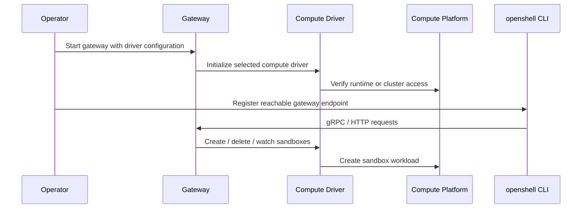
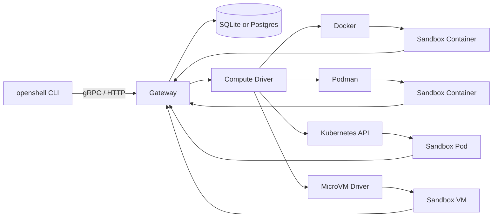

# Gateway Deployment and Compute Platforms

This document describes the OpenShell gateway deployment model. Operators run a gateway endpoint and configure the compute driver that should create sandboxes.

The Helm chart remains in this repository as the supported Kubernetes deployment artifact. Docker, Podman, and the experimental MicroVM runtime remain first-class compute platforms for local and specialized deployments.

## Goals and Scope

- Keep the gateway deployable as a standard process, container, or Kubernetes Helm release.
- Keep the Helm chart for Kubernetes deployments.
- Keep the gateway image independent from the compute runtime.
- Make compute-platform dependencies explicit.
- Preserve CLI gateway registration and selection as the way users target an already-running gateway.

Out of scope:

- Provisioning Kubernetes, Docker, Podman, or VM host infrastructure.
- Defining a new one-command mTLS import flow for every deployment type.

## Components

- `crates/openshell-server`: Gateway API server, persistence, inference route management, SSH relay, and compute-driver integration.
- `crates/openshell-driver-kubernetes`: Kubernetes compute driver for sandbox pods and Kubernetes resources.
- `crates/openshell-driver-docker`: Docker compute driver for local sandbox containers.
- `crates/openshell-driver-vm`: VM compute driver for libkrun-backed sandboxes.
- Podman driver path: rootless container execution compatible with the Podman runtime model.
- `deploy/helm/openshell`: Helm chart for deploying the gateway and Kubernetes driver configuration.
- `deploy/docker/Dockerfile.images` target `gateway`: Builds the published gateway image.
- `crates/openshell-cli`: CLI commands that register, select, and talk to gateways.

## Deployment Flow

## Supported Compute Platforms

| Platform | Gateway shape | Sandbox workload | Primary dependencies |
|---|---|---|---|
| Docker | Standalone gateway process or container on a host with Docker access. | Local containers. | Docker daemon, image pull/build access, local networking. |
| Podman | Standalone gateway process with Podman socket access. | Rootless or user-scoped containers. | Podman socket, rootless networking, image pull/build access. |
| Kubernetes | Gateway StatefulSet installed by Helm. | Sandbox pods. | Kubernetes API, namespace, service account, RBAC, storage, secrets. |
| MicroVM | Gateway process with VM driver access. | VM-backed sandboxes. | VM runtime rootfs, libkrun-based driver, host virtualization support. |

## Kubernetes Helm Deployment

The Helm chart at `deploy/helm/openshell` owns Kubernetes deployment concerns:

- Gateway StatefulSet and persistent volume claim.
- Service account, RBAC, and service.
- Gateway service exposure.
- TLS secret mounts and environment variables.
- Sandbox namespace, default sandbox image, and callback endpoint configuration.
- NetworkPolicy restricting sandbox SSH ingress to the gateway.

The chart expects these operator-provided inputs:

| Input | Purpose |
|---|---|
| Namespace | Release namespace and default sandbox namespace. |
| `openshell-ssh-handshake` Secret | HMAC key used by the SSH relay handshake. |
| `openshell-server-tls` Secret | Server certificate and key when TLS is enabled. |
| `openshell-server-client-ca` Secret | CA bundle used by the gateway to verify client certificates. |
| `openshell-client-tls` Secret | Client certificate bundle mounted into sandbox pods. |
| StorageClass / PVC support | Persistent gateway SQLite data when using the default `server.dbUrl`. |
| Service exposure | Port-forward, ingress, load balancer, or NodePort for CLI access. |

For local Kubernetes evaluation, TLS may be disabled with `server.disableTls=true` and the service can be reached through `kubectl port-forward`. Production deployments should keep TLS enabled or place the gateway behind a trusted TLS-terminating access proxy.

Key Helm values:

| Value | Effect |
|---|---|
| `image.repository`, `image.tag` | Select the gateway image. |
| `service.type`, `service.port`, `service.nodePort` | Expose the gateway service. |
| `server.dbUrl` | Select SQLite or Postgres persistence. |
| `server.sandboxNamespace` | Namespace for sandbox resources. |
| `server.sandboxImage` | Default sandbox image. |
| `server.grpcEndpoint` | Endpoint sandbox supervisors use to call back to the gateway. |
| `server.sshGatewayHost`, `server.sshGatewayPort` | Host and port returned to CLI clients for SSH proxy connections. |
| `server.disableTls`, `server.disableGatewayAuth` | Transport/authentication mode. |
| `server.tls.*` | Names of TLS secrets mounted into the gateway and sandboxes. |

## Runtime Shape

The gateway process manages all OpenShell control-plane APIs. It persists records in SQLite or Postgres, watches sandbox state through the selected compute driver, and brokers SSH access through supervisor-initiated relay streams.

## Operational Notes

- Gateway endpoint registration should use `openshell gateway add <endpoint>` regardless of compute platform.
- Kubernetes chart changes should be validated with `helm lint deploy/helm/openshell` and an install into a disposable namespace when possible.
- Docker driver changes should be validated with `mise run gateway:docker` or `mise run e2e:docker`.
- Podman driver changes should be validated with `mise run e2e:podman`.
- VM driver changes should be validated with `mise run e2e:vm`.
- Gateway image changes should be validated by building `deploy/docker/Dockerfile.images` target `gateway`.
- Published docs should describe gateway deployment and endpoint registration.
