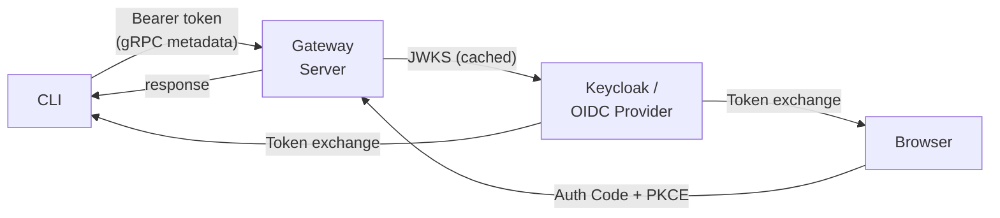

# OIDC Authentication

OpenShell supports OAuth2/OIDC (OpenID Connect) as an authentication mode alongside mTLS and Cloudflare Access. When enabled, the gateway server validates JWT bearer tokens on gRPC requests against an OIDC provider's JWKS endpoint. The CLI acquires tokens via browser-based login (Authorization Code + PKCE) or environment variables (Client Credentials).

## Architecture



## Auth Modes

OpenShell determines the authentication strategy per gateway via the `auth_mode` field in gateway metadata (`~/.config/openshell/gateways/<name>/metadata.json`):

| `auth_mode` | Transport | Identity | Token Storage |
|---|---|---|---|
| `"mtls"` | mTLS client cert | Cert CN | N/A |
| `"plaintext"` | HTTP (no TLS) | None | N/A |
| `"cloudflare_jwt"` | Edge TLS (CF Tunnel) | CF Access JWT | `edge_token` file |
| `"oidc"` | mTLS or plaintext | OIDC JWT | `oidc_token.json` |

## Token Acquisition

### Interactive: Authorization Code + PKCE

Used by `openshell gateway login` for interactive CLI sessions. The login flow accepts a `client_id` (the OIDC client application) and an optional `audience` (the API resource server). When `audience` differs from `client_id` — common with providers like Entra ID — it is appended to the authorization URL so the issued token targets the correct API.

```
CLI                            Browser                       Keycloak
 |                               |                              |
 |  1. Discover OIDC endpoints   |                              |
 |  GET {issuer}/.well-known/openid-configuration               |
 |                               |                              |
 |  2. Generate PKCE pair        |                              |
 |     code_verifier  = random(32 bytes) -> base64url           |
 |     code_challenge = base64url(SHA256(code_verifier))        |
 |     state          = random(16 bytes) -> hex                 |
 |                               |                              |
 |  3. Start localhost callback  |                              |
 |     on 127.0.0.1:<random>     |                              |
 |                               |                              |
 |  4. Open browser              |                              |
 |  -------xdg-open------------->|                              |
 |                               |  5. Redirect to Keycloak     |
 |                               |  /auth?response_type=code    |
 |                               |  &client_id={client_id}      |
 |                               |  &redirect_uri=localhost:... |
 |                               |  &code_challenge=...         |
 |                               |  &code_challenge_method=S256 |
 |                               |  &state=...                  |
 |                               |  [&audience={audience}]      |
 |                               |  --------------------------->|
 |                               |                              |
 |                               |                 6. User logs |
 |                               |                    in        |
 |                               |                              |
 |                               |  7. Redirect back            |
 |                               |  <-- ?code=...&state=... ---|
 |                               |                              |
 |  8. Receive code on callback  |                              |
 |  <----GET /callback?code=..---|                              |
 |                               |                              |
 |  9. Validate state matches    |                              |
 |                               |                              |
 | 10. Exchange code for tokens  |                              |
 |  POST {token_endpoint}        |                              |
 |    grant_type=authorization_code                             |
 |    code=...                   |                              |
 |    redirect_uri=...           |                              |
 |    client_id={client_id}      |                              |
 |    code_verifier=...  ------------------------------------->|
 |                               |                              |
 |  <-- { access_token, refresh_token, expires_in } -----------|
 |                               |                              |
 | 11. Store token bundle        |                              |
 |     ~/.config/openshell/gateways/<name>/oidc_token.json      |
```

### Non-Interactive: Client Credentials

Used for CI/automation when `OPENSHELL_OIDC_CLIENT_SECRET` is set. The optional `audience` parameter is included when the API resource server differs from the client ID.

```
CI Agent                                                    Keycloak
 |                                                             |
 |  POST {token_endpoint}                                      |
 |    grant_type=client_credentials                            |
 |    client_id={client_id}                                    |
 |    client_secret={OPENSHELL_OIDC_CLIENT_SECRET}             |
 |    [audience={audience}]  --------------------------------->|
 |                                                             |
 |  <-- { access_token, expires_in } -------------------------|
 |                                                             |
 |  Store token bundle (no refresh_token)                      |
```

## Token Storage

OIDC tokens are stored as JSON at `~/.config/openshell/gateways/<name>/oidc_token.json` with `0600` permissions:

```json
{
  "access_token": "eyJhbGci...",
  "refresh_token": "eyJhbGci...",
  "expires_at": 1718400300,
  "issuer": "http://localhost:8180/realms/openshell",
  "client_id": "openshell-cli"
}
```

The CLI checks `expires_at` before each request. If the token is within 30 seconds of expiry and a `refresh_token` is available, it silently refreshes via the token endpoint's `refresh_token` grant. If refresh fails, the user is prompted to re-authenticate with `openshell gateway login`.

## Per-Request Flow

On every gRPC call, the CLI interceptor injects the token as a standard HTTP header:

```
authorization: Bearer eyJhbGci...
```

The server-side auth middleware (`AuthGrpcRouter` in `multiplex.rs`) classifies each request into one of three categories and processes it accordingly:

1. **Strip internal markers** — remove `x-openshell-auth-source` from incoming headers to prevent spoofing.
2. **Unauthenticated?** — health probes and reflection pass through with no auth.
3. **Sandbox-secret?** — supervisor RPCs validate the `x-sandbox-secret` header against the server's SSH handshake secret. On success, mark the request with an internal `x-openshell-auth-source: sandbox-secret` header for downstream authorization.
4. **Dual-auth?** — methods like `UpdateConfig` try sandbox-secret first; if no valid secret, fall through to Bearer token validation.
5. **Bearer token** — extract `authorization: Bearer <token>`, decode the JWT header for `kid`, look up the signing key in the JWKS cache, and validate signature (RS256), `exp`, `iss`, `aud` claims.
6. **Authorize** — on successful authentication, check RBAC roles via `AuthzPolicy` (in `authz.rs`).
7. On any failure, return `UNAUTHENTICATED` or `PERMISSION_DENIED` status.

## JWKS Key Caching

The server fetches the OIDC provider's JSON Web Key Set at startup via discovery:

```
GET {issuer}/.well-known/openid-configuration  ->  jwks_uri
GET {jwks_uri}                                 ->  { keys: [...] }
```

Keys are cached in memory with a configurable TTL (default: 1 hour). A `refresh_mutex` serializes refresh operations so concurrent requests coalesce into a single HTTP fetch. The cache refreshes:

- When the TTL expires (on next request, re-checked under the mutex to avoid thundering herd).
- Immediately when a JWT references a `kid` not in the cache (handles key rotation).

## Method Authentication Categories

Every gRPC method falls into one of three categories, defined in `oidc.rs`:

### Unauthenticated

These methods require no authentication at all — health probes and infrastructure endpoints.

| Method / Prefix | Reason |
|---|---|
| `OpenShell/Health` | Kubernetes liveness/readiness probes |
| `Inference/Health` | Inference service health probes |
| `/grpc.reflection.*` | gRPC server reflection (debugging tools) |
| `/grpc.health.*` | gRPC health check protocol |

### Sandbox-Secret Authenticated

Sandbox-to-server RPCs authenticate via the `x-sandbox-secret` metadata header, which must match the server's SSH handshake secret. These methods do not use OIDC Bearer tokens.

| Method | Purpose |
|---|---|
| `SandboxService/GetSandboxConfig` | Supervisor fetches sandbox configuration |
| `ReportPolicyStatus` | Supervisor reports policy enforcement status |
| `PushSandboxLogs` | Supervisor streams sandbox logs to gateway |
| `GetSandboxProviderEnvironment` | Supervisor fetches provider credentials |
| `SubmitPolicyAnalysis` | Supervisor submits policy analysis results |
| `Inference/GetInferenceBundle` | Supervisor fetches resolved inference routes and provider API keys |

### Dual-Auth

These methods accept either an OIDC Bearer token (CLI users) or a sandbox secret (supervisor). The middleware tries sandbox-secret first; if not present, it falls through to Bearer token validation.

| Method | Purpose |
|---|---|
| `UpdateConfig` | Policy and settings mutations |
| `OpenShell/GetSandboxConfig` | CLI reads effective sandbox policy and settings; sandbox callers may still use the shared secret |

**Sandbox-secret restriction on `UpdateConfig`:** When a sandbox-secret-authenticated caller invokes `UpdateConfig`, the handler in `policy.rs` enforces strict scope limits via `validate_sandbox_secret_update()`. The caller:

- **Must** provide a sandbox `name` (sandbox-scoped only).
- **Must** include a `policy` payload (policy sync only).
- **May not** set `global = true` (no global config mutation).
- **May not** set `delete_setting` (no setting deletion).
- **May not** provide a `setting_key` (no setting mutation).

This ensures the sandbox supervisor can sync its own policy on startup but cannot modify global configuration or sandbox settings.

## Role-Based Access Control (RBAC)

After JWT validation, the server checks the user's roles against a per-method requirement. Roles are extracted from a configurable claim path in the JWT.

### Role Mapping

| Operation | Required Role |
|---|---|
| Health probes, reflection | (no auth — unauthenticated) |
| Supervisor-only RPCs (`SandboxService/GetSandboxConfig`, `GetInferenceBundle`, etc.) | (sandbox secret — no RBAC) |
| UpdateConfig via sandbox secret | (sandbox secret — scope-restricted, no RBAC) |
| OpenShell/GetSandboxConfig via Bearer | user role |
| Sandbox create, list, delete, exec, SSH | user role |
| Provider list, get | user role |
| Provider create, update, delete | admin role |
| Global config/policy updates | admin role |
| Draft policy approvals/rejections | admin role |
| All other authenticated RPCs | user role |

### Configurable Roles

The roles claim path and role names are configurable to support different OIDC providers. Each provider stores roles differently in the JWT:

| Provider | Roles Claim | Example Admin Role | Example User Role |
|---|---|---|---|
| Keycloak | `realm_access.roles` (default) | `openshell-admin` | `openshell-user` |
| Microsoft Entra ID | `roles` | `OpenShell.Admin` | `OpenShell.User` |
| Okta | `groups` | `openshell-admin` | `openshell-user` |
| GitHub | N/A | (empty — skip RBAC) | (empty — skip RBAC) |

When both `--oidc-admin-role` and `--oidc-user-role` are set to empty strings, RBAC is skipped entirely — any valid JWT is authorized. This supports providers like GitHub that don't emit roles in JWTs (authentication-only mode).

**Security note on authentication-only mode:** In this mode, the server validates token signature, issuer, and audience, but does not restrict which principals can call which methods. Any entity able to mint a valid token for the configured audience gains full access. For GitHub Actions, this means any workflow in any repository that can request a token with the configured audience is authorized. Consider using scope enforcement (`--oidc-scopes-claim`) or restricting the audience to limit the blast radius.

## Scope-Based Fine-Grained Permissions

Scopes provide opt-in, per-method access control on top of roles. When `--oidc-scopes-claim` is set, the server extracts scopes from the JWT and checks them against an exhaustive method-to-scope map. A caller must have both the required role AND the required scope.

### Scope Definitions

| Scope | Operations |
|---|---|
| `sandbox:read` | GetSandbox, ListSandboxes, WatchSandbox, GetSandboxLogs, GetSandboxPolicyStatus, ListSandboxPolicies |
| `sandbox:write` | CreateSandbox, DeleteSandbox, ExecSandbox, CreateSshSession, RevokeSshSession |
| `provider:read` | GetProvider, ListProviders |
| `provider:write` | CreateProvider, UpdateProvider, DeleteProvider |
| `config:read` | GetGatewayConfig, GetSandboxConfig, GetDraftPolicy, GetDraftHistory |
| `config:write` | UpdateConfig (Bearer), ApproveDraftChunk, ApproveAllDraftChunks, RejectDraftChunk, EditDraftChunk, UndoDraftChunk, ClearDraftChunks |
| `inference:read` | GetClusterInference |
| `inference:write` | SetClusterInference |
| `openshell:all` | All of the above (wildcard) |

Methods not listed in the scope map require `openshell:all`. Scopes cannot escalate privilege — `openshell:all` on a user-role token still cannot call admin methods.

### Authorization Flow

```
Request arrives (Bearer-authenticated)
  │
  ├── Role check (existing)
  │     └── Does identity have required role? No → PERMISSION_DENIED
  │
  └── Scope check (only if --oidc-scopes-claim is configured)
        ├── Does identity have openshell:all? → proceed
        ├── Does identity have required scope for this method? → proceed
        └── No → PERMISSION_DENIED("scope 'X' required")
```

When `--oidc-scopes-claim` is not set (default), scope enforcement is disabled and roles alone determine access. Auth-only mode (empty role names) still enforces scopes when enabled.

### Scope Extraction

The server extracts scopes from the JWT claim path configured by `--oidc-scopes-claim`. Two formats are supported:

- **Space-delimited string** (Keycloak, Entra ID): `"openid sandbox:read sandbox:write"`
- **JSON array** (Okta): `["sandbox:read", "sandbox:write"]`

Standard OIDC scopes (`openid`, `profile`, `email`, `offline_access`) are filtered out before enforcement.

### CLI Scope Requests

The `--oidc-scopes` flag on `gateway add` and `gateway start` is stored in gateway metadata and included in OAuth2 token requests:

- **Browser flow**: appended to the `scope` parameter alongside `openid`
- **Client credentials flow**: sent as-is (without `openid`, which is inappropriate for service tokens)
- **Token refresh**: scopes are not re-sent; the authorization server preserves them per RFC 6749 §6

### Provider Compatibility

| Provider | Scopes Claim | Format | Fine-Grained Selection |
|---|---|---|---|
| Keycloak | `scope` | Space-delimited | Yes — client requests specific scopes |
| Okta | `scp` | JSON array | Yes — client requests specific scopes |
| Entra ID | `scp` | Space-delimited | Limited — uses `.default` for all granted permissions |
| GitHub | N/A | N/A | No — use with scopes disabled |

### Keycloak Client Scopes

The dev realm (`scripts/keycloak-realm.json`) includes all 9 OpenShell scopes as **optional scopes** on `openshell-cli` and `openshell:all` as a **default scope** on `openshell-ci`. Built-in Keycloak scopes (`openid`, `profile`, `email`, `roles`, `web-origins`, `acr`) are assigned as default scopes on both clients so roles and profile claims are always present regardless of optional scope requests.

## Server Configuration

### Server Binary Flags

These flags configure JWT validation on the `openshell-server` binary:

| Flag | Env Var | Default | Description |
|---|---|---|---|
| `--oidc-issuer` | `OPENSHELL_OIDC_ISSUER` | (none) | OIDC issuer URL (enables JWT validation) |
| `--oidc-audience` | `OPENSHELL_OIDC_AUDIENCE` | `openshell-cli` | Expected `aud` claim in validated JWTs |
| `--oidc-jwks-ttl` | `OPENSHELL_OIDC_JWKS_TTL` | `3600` | JWKS cache TTL in seconds |
| `--oidc-roles-claim` | `OPENSHELL_OIDC_ROLES_CLAIM` | `realm_access.roles` | Dot-separated path to roles array in JWT |
| `--oidc-admin-role` | `OPENSHELL_OIDC_ADMIN_ROLE` | `openshell-admin` | Role name for admin access |
| `--oidc-user-role` | `OPENSHELL_OIDC_USER_ROLE` | `openshell-user` | Role name for user access |
| `--oidc-scopes-claim` | `OPENSHELL_OIDC_SCOPES_CLAIM` | (empty) | Claim path for scopes; enables scope enforcement when set |

When `--oidc-issuer` is not set, OIDC validation is disabled and the server falls back to mTLS-only or plaintext behavior.

### Gateway Start Flags (CLI)

The `openshell gateway start` command exposes flags that configure both the server and the local gateway metadata:

| Flag | Default | Description |
|---|---|---|
| `--oidc-issuer` | (none) | OIDC issuer URL; passed to the server binary |
| `--oidc-audience` | `openshell-cli` | Expected `aud` claim; passed to the server binary |
| `--oidc-client-id` | `openshell-cli` | Client ID stored in gateway metadata for CLI login flows |
| `--oidc-roles-claim` | (none) | Passed to the server binary if set |
| `--oidc-admin-role` | (none) | Passed to the server binary if set |
| `--oidc-user-role` | (none) | Passed to the server binary if set |
| `--oidc-scopes-claim` | (none) | Passed to the server binary; enables scope enforcement |
| `--oidc-scopes` | (none) | Stored in gateway metadata; included in CLI token requests |

The `--oidc-client-id` flag is **not** a server flag — it is stored in gateway metadata and used by the CLI during login. The `--oidc-audience` flag is both a server flag (for JWT validation) and stored in metadata (for token requests).

### Helm Values

```yaml
server:
  oidc:
    issuer: "https://keycloak.example.com/realms/openshell"
    audience: "openshell-cli"
    jwksTtl: 3600
    scopesClaim: "scope"   # enable scope enforcement (Keycloak)
```

### Discovery Endpoint

The server exposes `GET /auth/oidc-config` which returns the configured OIDC issuer and audience. This allows CLI auto-discovery during `gateway add`.

## Provider Examples

### Keycloak

```bash
openshell gateway start \
  --oidc-issuer http://keycloak:8180/realms/openshell
# Defaults work: realm_access.roles, openshell-admin, openshell-user
```

### Microsoft Entra ID

Register an app in Azure Portal with app roles `OpenShell.Admin` and `OpenShell.User`. With Entra ID the client ID (the SPA/public app registration) and audience (the API app registration, e.g. `api://openshell`) are typically different:

```bash
openshell gateway start \
  --oidc-issuer https://login.microsoftonline.com/{tenant-id}/v2.0 \
  --oidc-audience api://openshell \
  --oidc-client-id {client-id} \
  --oidc-roles-claim roles \
  --oidc-admin-role OpenShell.Admin \
  --oidc-user-role OpenShell.User
```

CLI registration (separate client ID and audience):

```bash
openshell gateway add https://gateway:8080 \
  --oidc-issuer https://login.microsoftonline.com/{tenant-id}/v2.0 \
  --oidc-client-id {client-id} \
  --oidc-audience api://openshell
```

### Okta

Create an authorization server with a `groups` claim, then:

```bash
openshell gateway start \
  --oidc-issuer https://dev-xxxxx.okta.com/oauth2/default \
  --oidc-roles-claim groups \
  --oidc-admin-role openshell-admin \
  --oidc-user-role openshell-user
```

### GitHub (Authentication Only)

GitHub's OIDC tokens (from Actions) don't carry roles. Use empty role names to skip RBAC — any valid GitHub JWT is authorized:

```bash
openshell gateway start \
  --oidc-issuer https://token.actions.githubusercontent.com \
  --oidc-audience https://github.com/{org} \
  --oidc-admin-role "" \
  --oidc-user-role ""
```

## CLI Commands

### Register an OIDC Gateway

```bash
openshell gateway add http://gateway:8080 \
  --oidc-issuer http://keycloak:8180/realms/openshell

# With custom client ID:
openshell gateway add http://gateway:8080 \
  --oidc-issuer http://keycloak:8180/realms/openshell \
  --oidc-client-id my-client

# With separate client ID and audience (e.g. Entra ID):
openshell gateway add http://gateway:8080 \
  --oidc-issuer https://login.microsoftonline.com/{tenant-id}/v2.0 \
  --oidc-client-id {client-id} \
  --oidc-audience api://openshell
```

### Start a K3s Gateway with OIDC

```bash
openshell gateway start \
  --oidc-issuer http://keycloak:8180/realms/openshell \
  --plaintext

# With RBAC configuration:
openshell gateway start \
  --oidc-issuer http://keycloak:8180/realms/openshell \
  --oidc-client-id openshell-cli \
  --oidc-roles-claim realm_access.roles \
  --oidc-admin-role openshell-admin \
  --oidc-user-role openshell-user
```

### Authenticate

```bash
# Interactive (opens browser)
openshell gateway login
# Expected: ✓ Authenticated to gateway 'openshell' as admin@test

# CI / automation
OPENSHELL_OIDC_CLIENT_SECRET=secret openshell gateway login
```

### Logout

```bash
openshell gateway logout
# Expected: ✓ Logged out of gateway 'openshell'
```

## Keycloak Setup

### Realm Configuration

The `scripts/keycloak-realm.json` file provides a pre-configured realm for development:

- **Realm**: `openshell`
- **Clients**:
  - `openshell-cli` — Public client, Authorization Code + PKCE, redirect URIs `http://127.0.0.1:*`
  - `openshell-ci` — Confidential client, Client Credentials grant, secret `ci-test-secret`
- **Roles**: `openshell-admin`, `openshell-user`
- **Test Users**:
  - `admin@test` / `admin` (roles: `openshell-admin`, `openshell-user`)
  - `user@test` / `user` (roles: `openshell-user`)

### Dev Server

```bash
# Start Keycloak on port 8180
./scripts/keycloak-dev.sh start

# Check status
./scripts/keycloak-dev.sh status

# Stop
./scripts/keycloak-dev.sh stop
```

Admin console: `http://localhost:8180/admin` (admin/admin).

## Coexistence with Other Auth Modes

OIDC is additive — it does not replace mTLS or Cloudflare Access. When OIDC is configured, the `AuthGrpcRouter` processes requests through the three-category classification:

```
Request arrives
  |
  +-- Strip x-openshell-auth-source (anti-spoofing)
  |
  +-- OIDC not configured? --> Pass through (mTLS/plaintext fallback)
  |
  +-- Unauthenticated method? --> Pass through
  |
  +-- Sandbox-secret method?
  |     +-- Valid x-sandbox-secret --> Mark auth-source, pass through
  |     +-- Invalid/missing        --> UNAUTHENTICATED
  |
  +-- Dual-auth method?
  |     +-- Valid x-sandbox-secret --> Mark auth-source, pass through
  |     +-- No sandbox secret      --> Fall through to Bearer
  |
  +-- Has "authorization: Bearer" header?
  |     +-- Validate JWT --> Check RBAC --> Check scopes (if enabled) --> Authenticated (OIDC)
  |     +-- Invalid JWT  --> UNAUTHENTICATED
  |
  +-- No bearer header --> UNAUTHENTICATED
```

The CLI determines which auth mode to use based on `auth_mode` in gateway metadata. Only one mode is active per gateway registration.

## Key Files

| Component | File |
|---|---|
| Server OIDC validation + method classification | `crates/openshell-server/src/oidc.rs` |
| Server auth middleware | `crates/openshell-server/src/multiplex.rs` (`AuthGrpcRouter`) |
| Server authorization (RBAC) | `crates/openshell-server/src/authz.rs` (`AuthzPolicy`) |
| Sandbox-secret scope enforcement | `crates/openshell-server/src/grpc/policy.rs` (`validate_sandbox_secret_update`) |
| Server config | `crates/openshell-core/src/config.rs` (`OidcConfig`) |
| Server CLI flags | `crates/openshell-server/src/main.rs` |
| Server discovery endpoint | `crates/openshell-server/src/auth.rs` (`/auth/oidc-config`) |
| CLI OIDC flows | `crates/openshell-cli/src/oidc_auth.rs` |
| CLI interceptor | `crates/openshell-cli/src/tls.rs` (`EdgeAuthInterceptor`) |
| CLI auth dispatch | `crates/openshell-cli/src/main.rs` (`apply_auth`) |
| CLI gateway commands | `crates/openshell-cli/src/run.rs` (`gateway_add`, `gateway_login`) |
| Token storage | `crates/openshell-bootstrap/src/oidc_token.rs` |
| Gateway metadata | `crates/openshell-bootstrap/src/metadata.rs` |
| Bootstrap pipeline | `crates/openshell-bootstrap/src/lib.rs`, `docker.rs` |
| K3s entrypoint | `deploy/docker/cluster-entrypoint.sh` |
| HelmChart template | `deploy/kube/manifests/openshell-helmchart.yaml` |
| Helm values | `deploy/helm/openshell/values.yaml` |
| Helm statefulset | `deploy/helm/openshell/templates/statefulset.yaml` |
| Keycloak dev script | `scripts/keycloak-dev.sh` |
| Keycloak realm config | `scripts/keycloak-realm.json` |
