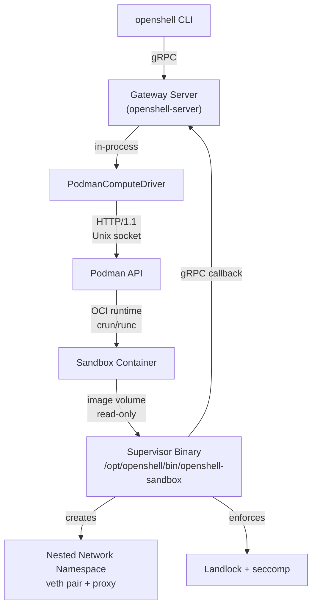
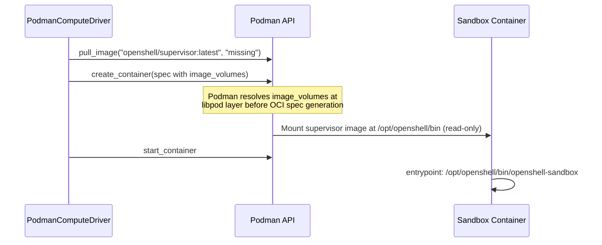
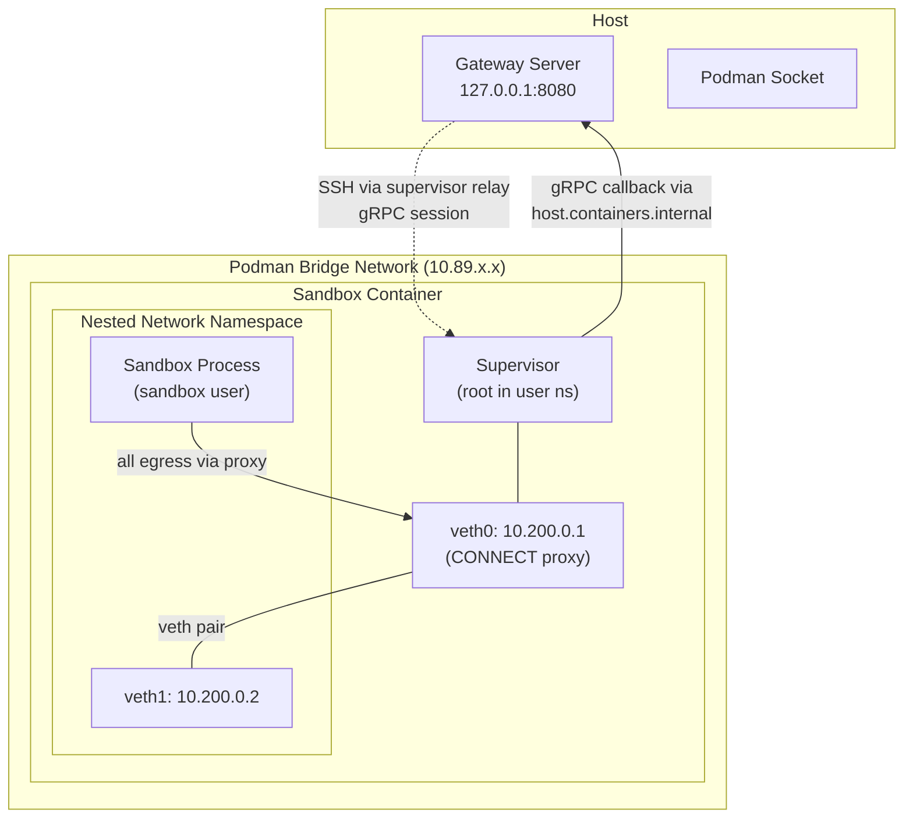
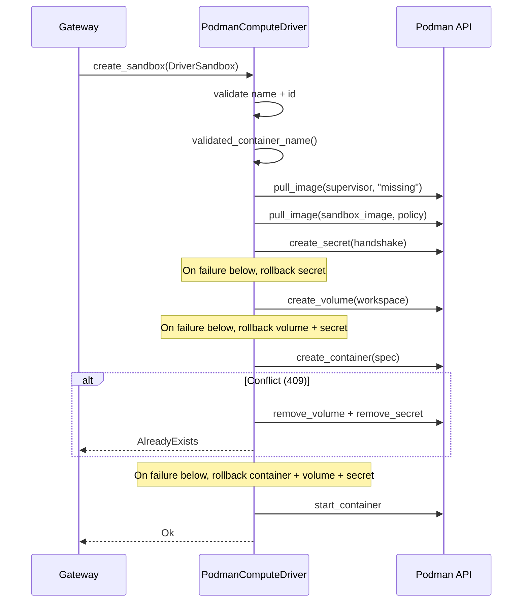

# Podman Compute Driver

The Podman compute driver manages sandbox containers via the Podman REST API over a Unix socket. It targets single-machine and developer environments where rootless container isolation is preferred over a full Kubernetes cluster. The driver runs in-process within the gateway server and delegates all sandbox isolation enforcement to the `openshell-sandbox` supervisor binary, which is sideloaded into each container via an OCI image volume mount.

## Source File Index

All paths are relative to `crates/openshell-driver-podman/src/`.

| File | Purpose |
|------|---------|
| `lib.rs` | Crate root; declares modules and re-exports `PodmanComputeConfig`, `PodmanComputeDriver`, `ComputeDriverService` |
| `main.rs` | Standalone binary entrypoint; parses CLI args/env vars, constructs the driver, starts a gRPC server with graceful shutdown |
| `driver.rs` | Core `PodmanComputeDriver` -- sandbox lifecycle (create/stop/delete/list/get), endpoint resolution, GPU detection, rootless pre-flight checks |
| `client.rs` | `PodmanClient` -- async HTTP/1.1 client over Unix socket for the Podman libpod REST API (containers, volumes, networks, secrets, images, events, system info) |
| `container.rs` | Container spec construction -- labels, env vars, resource limits, capabilities, seccomp config, health checks, port mappings, image volumes, secret injection |
| `config.rs` | `PodmanComputeConfig` struct, `ImagePullPolicy` enum, default socket path resolution, `Debug` impl that redacts secrets |
| `grpc.rs` | `ComputeDriverService` -- tonic gRPC service mapping RPCs to driver methods, with error-to-Status conversion |
| `watcher.rs` | Watch stream -- initial state sync via container list, then live Podman events mapped to `WatchSandboxesEvent` protobuf messages |

## Architecture

The Podman driver is one of three `ComputeDriver` implementations. It communicates with the Podman daemon over a Unix socket and delegates sandbox isolation to the supervisor binary running inside each container.

### Driver Comparison

| Aspect | Kubernetes | VM (libkrun) | Podman |
|--------|-----------|--------------|--------|
| Execution model | In-process | Standalone subprocess (gRPC over UDS) | In-process |
| Backend | K8s API (CRD + controller) | libkrun hypervisor (KVM/HVF) | Podman REST API (Unix socket) |
| Isolation boundary | Container (supervisor inside pod) | Hardware VM | Container (supervisor inside container) |
| Supervisor delivery | hostPath volume (read-only) | Embedded in rootfs tarball | OCI image volume (read-only) |
| Network model | Supervisor creates netns inside pod | gvproxy virtio-net (192.168.127.0/24) | Supervisor creates netns inside container |
| Credential injection | Plaintext env var + K8s Secret volume (0400) | Rootfs file copy (0600) + env vars | Podman `secret_env` API + env vars |
| GPU support | Yes (nvidia.com/gpu resource) | No | Yes (CDI device) |
| `stop_sandbox` | Unimplemented | Unimplemented | Implemented (graceful stop) |
| State storage | Kubernetes API (CRD) | In-memory HashMap + filesystem | Podman daemon (container state) |
| Endpoint resolution | Pod IP / cluster DNS | 127.0.0.1 + allocated port | 127.0.0.1 + ephemeral port |

## Isolation Model

The Podman driver provides the same four protection layers as the Kubernetes driver. The driver itself does not implement isolation primitives directly -- it configures the container so that the `openshell-sandbox` supervisor binary can enforce them at runtime.

### Container Security Configuration

The container spec (`container.rs`) sets:

| Setting | Value | Rationale |
|---------|-------|-----------|
| `user` | `0:0` | Supervisor needs root for namespace creation, proxy setup, Landlock/seccomp |
| `cap_drop` | `ALL` | Drop all capabilities, then selectively add back |
| `cap_add` | `SYS_ADMIN, NET_ADMIN, SYS_PTRACE, SYSLOG, SETUID, SETGID, DAC_READ_SEARCH` | See capability breakdown below |
| `no_new_privileges` | `true` | Prevent privilege escalation after exec |
| `seccomp_profile_path` | `unconfined` | Supervisor installs its own policy-aware BPF filter; container-level profile would block Landlock/seccomp syscalls during setup |

### Capability Breakdown

The Kubernetes driver uses 4 capabilities (`SYS_ADMIN, NET_ADMIN, SYS_PTRACE, SYSLOG`). The Podman driver adds 3 more, all required for rootless operation:

| Capability | Shared with K8s? | Purpose |
|------------|------------------|---------|
| `SYS_ADMIN` | Yes | seccomp filter installation, namespace creation, Landlock |
| `NET_ADMIN` | Yes | Network namespace veth setup, IP/route configuration |
| `SYS_PTRACE` | Yes | Reading `/proc/<pid>/exe` and ancestor walk for binary identity |
| `SYSLOG` | Yes | Reading `/dev/kmsg` for bypass-detection diagnostics |
| `SETUID` | Podman only | `drop_privileges()` calls `setuid()` to sandbox user. Rootless `cap_drop: ALL` removes this from the bounding set. |
| `SETGID` | Podman only | `drop_privileges()` calls `setgid()` + `initgroups()`. Same rootless reason as SETUID. |
| `DAC_READ_SEARCH` | Podman only | Proxy reads `/proc/<pid>/fd/` across UIDs for binary identity. In rootless Podman, supervisor (UID 0 in user namespace) and sandbox processes have different UIDs. |

In the Kubernetes driver, these three capabilities are implicitly available because the kubelet does not drop them from the bounding set. In rootless Podman, `cap_drop: ALL` removes everything, requiring explicit re-addition.

All capabilities are only available to the supervisor process. Sandbox child processes lose them after `setuid()` to the sandbox user in the `pre_exec` hook.

## Supervisor Sideloading

The supervisor binary is delivered to sandbox containers via Podman's OCI image volume mechanism, distinct from both the Kubernetes hostPath approach and the VM's embedded rootfs.

The supervisor image is a `FROM scratch` image containing only the prebuilt `openshell-sandbox` binary. It is built by the `supervisor` target in `deploy/docker/Dockerfile.images`. The `image_volumes` field in the container spec mounts this image's filesystem at `/opt/openshell/bin` with `rw: false`, making it a read-only overlay that the sandbox cannot tamper with.

## TLS

When the Podman driver's TLS configuration is set (`tls_ca`, `tls_cert`, `tls_key` in `PodmanComputeConfig`), the driver:

1. Switches the auto-detected endpoint scheme from `http://` to `https://`
2. Bind-mounts the client cert files (read-only) into the container at `/etc/openshell/tls/client/`
3. Sets `OPENSHELL_TLS_CA`, `OPENSHELL_TLS_CERT`, `OPENSHELL_TLS_KEY` env vars pointing to the container-side paths

The supervisor reads these env vars and uses them to establish an mTLS connection back to the gateway.

The RPM packaging auto-generates a self-signed PKI on first start via `init-pki.sh`. Client certs are placed in the CLI auto-discovery directory (`~/.config/openshell/gateways/openshell/mtls/`) so the CLI connects with mTLS without manual configuration. See `deploy/rpm/CONFIGURATION.md` for the full RPM configuration reference and `deploy/rpm/QUICKSTART.md` for the quick start guide.

## Network Model

Sandbox network isolation uses a two-layer approach: a Podman bridge network for container-to-host communication, and a nested network namespace (created by the supervisor) for sandbox process isolation.

Key points:

- **Bridge network**: Created by `client.ensure_network()` with DNS enabled. Containers on the bridge can see each other at L3, but sandbox processes cannot because they are isolated inside the nested netns.
- **Nested netns**: The supervisor creates a private `NetworkNamespace` with a veth pair (10.200.0.1/24 <-> 10.200.0.2/24). Sandbox processes enter this netns via `setns(fd, CLONE_NEWNET)` in the `pre_exec` hook, forcing all traffic through the CONNECT proxy.
- **Port publishing**: SSH uses `host_port: 0` (ephemeral port assignment) for health checks and debug access. The gateway SSH tunnel uses the supervisor relay (`supervisor_sessions.open_relay()`) rather than connecting directly to the published port.
- **Host gateway**: `host.containers.internal:host-gateway` in `/etc/hosts` allows containers to reach the gateway server on the host.
- **nsenter**: The supervisor uses `nsenter --net=` instead of `ip netns exec` for namespace operations, avoiding the sysfs remount that fails in rootless containers.

## Supervisor relay (SSH Unix socket)

Podman now follows the same end-to-end contract as the Kubernetes and VM drivers for the in-container SSH relay: **gateway config → `PodmanComputeConfig` → sandbox environment → supervisor session registration on that path**.

1. `openshell-core` `Config::sandbox_ssh_socket_path` (gateway YAML / defaults) is copied into `PodmanComputeConfig::sandbox_ssh_socket_path` when the gateway builds the in-process driver (`crates/openshell-server/src/lib.rs`, `ComputeDriverKind::Podman`).
2. `build_env()` in `container.rs` sets `OPENSHELL_SSH_SOCKET_PATH` to that value, alongside required vars `OPENSHELL_ENDPOINT` and `OPENSHELL_SANDBOX_ID` (and `OPENSHELL_SANDBOX`, etc.). These driver-controlled entries overwrite user template env to prevent spoofing.
3. The supervisor reads `OPENSHELL_SSH_SOCKET_PATH` and uses it for the Unix socket the gateway’s SSH stack bridges to. The standalone `openshell-driver-podman` binary sets the same struct field from `OPENSHELL_SANDBOX_SSH_SOCKET_PATH` (`main.rs`).

## Credential Injection

The SSH handshake secret is injected via Podman's `secret_env` API rather than a plaintext environment variable.

| Credential | Mechanism | Visible in `inspect`? | Visible in `/proc/<pid>/environ`? |
|------------|-----------|----------------------|----------------------------------|
| SSH handshake secret | Podman `secret_env` (created via secrets API, referenced by name) | No | Yes (supervisor only; scrubbed from children) |
| Sandbox identity (`OPENSHELL_SANDBOX_ID`, etc.) | Plaintext env var | Yes | Yes |
| gRPC endpoint (`OPENSHELL_ENDPOINT`) | Plaintext env var, override-protected | Yes | Yes |
| Supervisor relay socket path (`OPENSHELL_SSH_SOCKET_PATH`) | Plaintext env var, override-protected (same value as `PodmanComputeConfig::sandbox_ssh_socket_path`) | Yes | Yes |

The `build_env()` function in `container.rs` inserts user-supplied variables first, then unconditionally overwrites all security-critical variables to prevent spoofing via sandbox templates: `OPENSHELL_SANDBOX`, `OPENSHELL_SANDBOX_ID`, `OPENSHELL_ENDPOINT`, `OPENSHELL_SSH_SOCKET_PATH`, `OPENSHELL_SSH_HANDSHAKE_SKEW_SECS`, `OPENSHELL_CONTAINER_IMAGE`, `OPENSHELL_SANDBOX_COMMAND`.

The `PodmanComputeConfig::Debug` impl redacts the handshake secret as `[REDACTED]`.

## Sandbox Lifecycle

### Creation Flow

Each step rolls back all previously-created resources on failure. The Conflict path (409 from container creation) cleans up the volume and secret because they are keyed by the new sandbox's ID, not the conflicting container's.

### Readiness and health

The container `healthconfig` in `container.rs` marks the sandbox healthy when **any** of these signals succeeds: legacy file marker `/var/run/openshell-ssh-ready`, **or** `test -S` on the configured supervisor Unix socket path (`sandbox_ssh_socket_path` / `OPENSHELL_SSH_SOCKET_PATH`), **or** the prior TCP check (`ss` listening on the in-container SSH port). That allows relay-only readiness when the supervisor exposes the socket without the old marker or published-port signal.

### Deletion Flow

1. Validate `sandbox_name` and stable `sandbox_id` from `DeleteSandboxRequest`
2. Best-effort inspect cross-checks the container label when present, but cleanup remains keyed by the request `sandbox_id`
3. Best-effort stop (result ignored)
4. Force-remove container (`?force=true&v=true`)
5. Remove workspace volume derived from the request `sandbox_id` (warn on failure, continue)
6. Remove handshake secret derived from the request `sandbox_id` (warn on failure, continue)

If the container is already gone during inspect or remove, the driver still performs idempotent volume/secret cleanup using the request `sandbox_id` and returns `Ok(false)` for the container-delete result. This prevents leaked Podman resources after out-of-band container removal or label drift.

## Configuration

| Environment Variable | CLI Flag | Default | Description |
|---------------------|----------|---------|-------------|
| `OPENSHELL_PODMAN_SOCKET` | `--podman-socket` | `$XDG_RUNTIME_DIR/podman/podman.sock` (Linux), `$HOME/.local/share/containers/podman/machine/podman.sock` (macOS) | Podman API Unix socket path |
| `OPENSHELL_SANDBOX_IMAGE` | `--sandbox-image` | (from gateway config) | Default OCI image for sandboxes |
| `OPENSHELL_SANDBOX_IMAGE_PULL_POLICY` | `--sandbox-image-pull-policy` | `missing` | Pull policy: `always`, `missing`, `never`, `newer` |
| `OPENSHELL_GRPC_ENDPOINT` | `--grpc-endpoint` | Auto-detected via `host.containers.internal` | Gateway gRPC endpoint for sandbox callbacks |
| `OPENSHELL_NETWORK_NAME` | `--network-name` | `openshell` | Podman bridge network name |
| `OPENSHELL_SANDBOX_SSH_PORT` | `--sandbox-ssh-port` | `2222` | SSH port inside the container |
| `OPENSHELL_SSH_HANDSHAKE_SECRET` | `--ssh-handshake-secret` | (required) | Shared secret for NSSH1 handshake |
| `OPENSHELL_SANDBOX_SSH_SOCKET_PATH` | `--sandbox-ssh-socket-path` | `/run/openshell/ssh.sock` | Standalone driver only: supervisor Unix socket path in `PodmanComputeConfig` (in-gateway Podman uses server `config.sandbox_ssh_socket_path`) |
| `OPENSHELL_STOP_TIMEOUT` | `--stop-timeout` | `10` | Container stop timeout in seconds (SIGTERM -> SIGKILL) |
| `OPENSHELL_SUPERVISOR_IMAGE` | `--supervisor-image` | `openshell/supervisor:latest` (struct default; standalone binary requires explicit value) | OCI image containing the supervisor binary |

## Rootless-Specific Adaptations

The Podman driver is designed for rootless operation. The following adaptations were made compared to the Kubernetes driver:

1. **subuid/subgid pre-flight check**: `check_subuid_range()` in `driver.rs` warns operators if `/etc/subuid` or `/etc/subgid` entries are missing for the current user. Not a hard error because some systems use LDAP or other mechanisms.

2. **cgroups v2 requirement**: The driver refuses to start if cgroups v1 is detected. Rootless Podman requires the unified cgroup hierarchy.

3. **nsenter for namespace operations**: `run_ip_netns()` and `run_iptables_netns()` in `crates/openshell-sandbox/src/sandbox/linux/netns.rs` use `nsenter --net=` instead of `ip netns exec` to avoid the sysfs remount that requires real `CAP_SYS_ADMIN` in the host user namespace.

4. **DAC_READ_SEARCH capability**: Required for the proxy to read `/proc/<pid>/fd/` across UIDs within the user namespace.

5. **SETUID/SETGID capabilities**: Required for `drop_privileges()` to call `setuid()`/`setgid()` after `cap_drop: ALL` removes them from the bounding set.

6. **host.containers.internal**: Used instead of Docker's `host.docker.internal` for container-to-host communication. Injected via `hostadd` with Podman's `host-gateway` magic value.

7. **Ephemeral port publishing**: SSH port uses `host_port: 0` because the bridge network IP (10.89.x.x) is not routable from the host in rootless mode. The published port is used for health checks and debug access; the gateway SSH tunnel uses the supervisor relay.

8. **tmpfs at `/run/netns`**: A private tmpfs is mounted so the supervisor can create named network namespaces via `ip netns add`, which requires `/run/netns` to exist and be writable.

## Implementation References

- Gateway integration: `crates/openshell-server/src/compute/mod.rs` (`new_podman` and `PodmanComputeDriver` wiring)
- Server configuration: `crates/openshell-server/src/lib.rs` (`ComputeDriverKind::Podman` — builds `PodmanComputeConfig` including `sandbox_ssh_socket_path` from gateway `Config`)
- Gateway relay path: `openshell-core` `Config::sandbox_ssh_socket_path` in `crates/openshell-core/src/config.rs`
- SSRF mitigation: `crates/openshell-core/src/net.rs` (IP classification: `is_always_blocked_ip`, `is_internal_ip`), `crates/openshell-sandbox/src/proxy.rs` (runtime enforcement on CONNECT/forward proxy), `crates/openshell-server/src/grpc/policy.rs` (load-time validation via `validate_rule_not_always_blocked`)
- Sandbox supervisor: `crates/openshell-sandbox/src/` (Landlock, seccomp, netns, proxy -- shared by all drivers)
- Container engine abstraction: `tasks/scripts/container-engine.sh` (build/deploy support for Docker and Podman)
- Supervisor image build: `deploy/docker/Dockerfile.images` (`supervisor-output` target)
